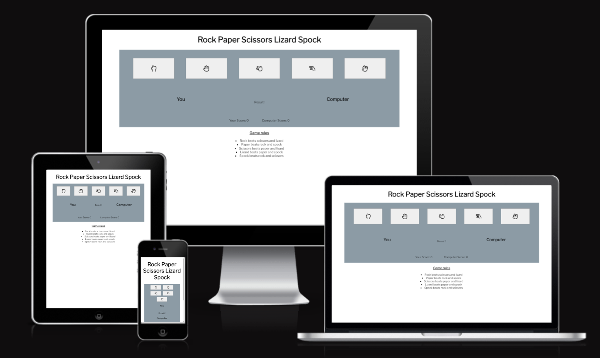
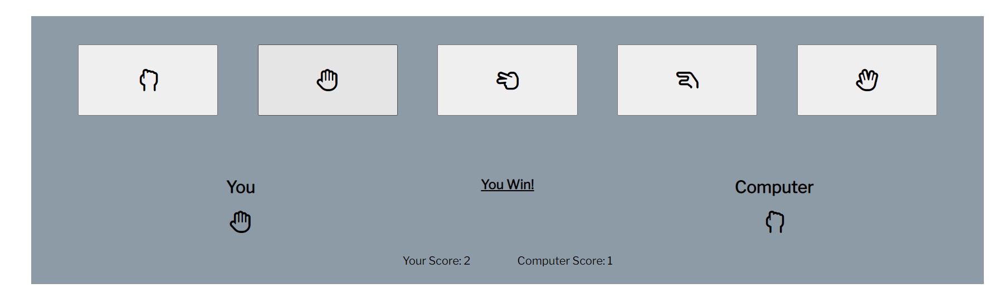
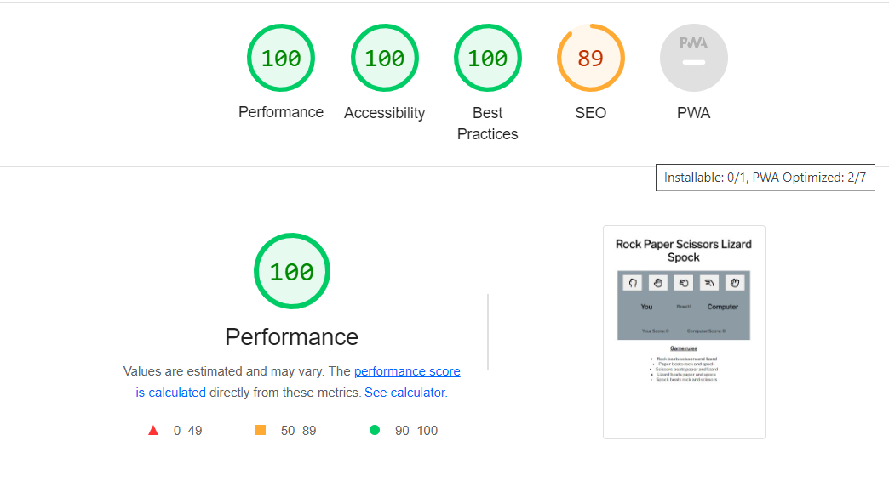

# Take A Chance

This website is aimed at people who would like to try their luck in a game of chance. This is a game where the user can pick rock, paper, scissors, lizard or spock to try their luck against a random selction that the computer picks.

## Features
- ### Header
  - The header of the website is simple and just displays the name of the game on the website

- ### Game Area
  - The game area is then split into 3 sections
    - The button section which allows the user to choose whether they will play as rock, paper, scissors, lizard or spock.
    - A current game section which shows the users choice, the computers choice and shows the winner of the game
    - A score section which keeps a tally of wins and icrements each time either the user or the computer wins a round

- ### Footer
  - The footer is used to display the rules of the game to users.

## Features not implemented
- A section where a user can pick best of 3, 5 etc and a funtion to declare the overall winner when the score is met
- A difficulty function where a drop down could select easy difficulty where the user would win 80% of the time and a hard difficulty where the computer would win 80% of the time

## Testing
- The website has been tested using Chrome, Edge and Firefox
- The website has been tested and is working on all different screen sizes

## Validator Testing
- HTML
  - The W3C validator showed no errors in the HTML file
- CSS
  - The W3C validator showed no errors in the CSS file
- JavaScript
  - JSHint showed multiple warnings for older browsers for using the let keyword to declare variables

## Bugs and Issues
 - The main issue on the site was the scaling of the buttons when the viewport reached mobile device size. The icons inside the buttons would not stay centered in these smaller sizes and drifted outside the buttons themselves the smaller the screen size got. The fix was to change the button layout at smaller device sizes and to reduce the font size of the icons at these smaller device widths.

## Accessibility
 - The accessibility of the website was tested using lighthouse and origionally got a score of 81 due to buttons not having an accessible name but adding aria-labels to the buttons brought the score to 100.

## Deployment 
- ### Deployed using GitHub pages
  - On the GitHub repository page navigate to settings
  - In the settings menu find the pages tab
  - On this page under build and deployment menu select main as the branch and hit save to begin page deployment

## Credits
- ### Content
  - The icons came from font awesome.